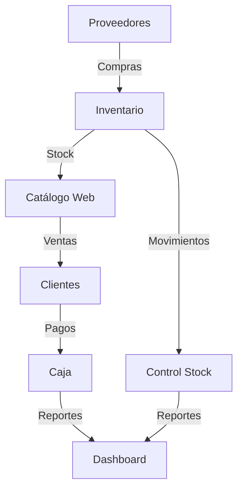

# Mi Tienda App - Resumen del Proyecto

## Descripción General

Mi Tienda App es un sistema e-commerce completo que combina una tienda online para el público general con un panel administrativo integral para la gestión comercial. El sistema permite a los clientes navegar por un catálogo de productos, realizar compras y gestionar su carrito, mientras que los administradores tienen acceso a herramientas completas para gestionar inventario, ventas, compras y operaciones de caja.

## Arquitectura del Sistema

### Estructura Monorepo
El proyecto está organizado como un monorepo con las siguientes aplicaciones:

- **Backend**: API RESTful construida con Express.js y TypeScript
- **Frontend**: Aplicación web construida con Next.js 16 y React
- **Packages**: Paquete compartido de tipos TypeScript para consistencia de datos

### Tecnologías Principales

#### Backend
- **Runtime**: Node.js con TypeScript
- **Framework**: Express.js
- **Base de Datos**: PostgreSQL con Prisma ORM
- **Autenticación**: JWT con bcryptjs para hashing de contraseñas
- **File Upload**: Multer para gestión de imágenes
- **Arquitectura**: Estructura por capas (Routes → Controllers → Services → Prisma)

#### Frontend
- **Framework**: Next.js 16 con App Router
- **UI**: React 19 con Tailwind CSS
- **State Management**: React Query (@tanstack/react-query) para gestión de servidor
- **Forms**: React Hook Form con Zod para validación
- **Charts**: Recharts para visualizaciones
- **PDF Generation**: jsPDF para reportes

#### Infraestructura
- **Containerización**: Docker con docker-compose
- **Base de Datos**: PostgreSQL persistente con volúmenes
- **Networking**: Red interna Docker para comunicación entre servicios

## Funcionalidades Principales

### Catálogo Público (Clientes)
- Navegación por categorías de productos
- Búsqueda de productos por nombre, código o tags
- Vista detallada de productos con múltiples imágenes
- Carrito de compras persistente
- Información de contacto de la tienda

### Panel Administrativo
- **Dashboard**: Métricas clave con gráficos de ventas y categorías
- **Gestión de Productos**: CRUD completo con control de stock
- **Gestión de Categorías**: Organización jerárquica de productos
- **Gestión de Proveedores**: Control de proveedores con soft delete
- **Punto de Ventas (POS)**: Sistema de ventas rápido con carrito integrado
- **Gestión de Compras**: Registro de compras a proveedores con lotes
- **Control de Inventario**: Movimientos de stock con trazabilidad FIFO
- **Gestión de Caja**: Control de movimientos de efectivo
- **Reportes**: Generación de reportes en PDF
- **Gestión de Usuarios**: Roles y permisos (SUPER_ADMIN, SUPER_VENDEDOR, VENDEDOR)

## Modelo de Datos

### Entidades Principales
- **Users**: Sistema de autenticación con roles jerárquicos
- **Products**: Catálogo con control de stock, precios y múltiples imágenes
- **Categories**: Clasificación de productos
- **Suppliers**: Gestión de proveedores con soft delete
- **Sales**: Registro de ventas con múltiples métodos de pago
- **Purchases**: Compras a proveedores con control de lotes
- **StockLots**: Sistema FIFO para gestión de inventario
- **StockMovements**: Trazabilidad completa de movimientos
- **CashMovements**: Control de operaciones de caja

### Características Avanzadas del Modelo
- **Soft Delete**: Eliminación lógica para productos y proveedores
- **Sistema FIFO**: Gestión de inventario por lotes con costo promedio
- **Trazabilidad Completa**: Registro de todos los movimientos de stock
- **Control de Costos**: Cálculo automático de ganancias por venta
- **Múltiples Métodos de Pago**: Yape, Plin, Efectivo, Transferencia, Cheque, Crédito

## Flujo de Operaciones

## Características Técnicas Destacables

### Seguridad
- Autenticación JWT con tokens seguros
- Hashing de contraseñas con bcryptjs
- Configuración CORS dinámica
- Validación de datos con Zod schemas

### Escalabilidad
- Arquitectura modular con separación de responsabilidades
- Tipado fuerte con TypeScript
- Paquete de tipos compartido entre frontend y backend
- Containerización para fácil despliegue

### Experiencia de Usuario
- Interfaz responsive con Tailwind CSS
- Estados de carga y manejo de errores
- Navegación intuitiva con sidebar administrativo
- Búsqueda y filtros en tiempo real

## Estado Actual del Proyecto

El proyecto se encuentra en un estado avanzado de desarrollo con todas las funcionalidades principales implementadas, incluyendo:
- Sistema completo de autenticación
- Gestión integral de inventario
- Sistema de ventas y compras
- Control de caja con trazabilidad
- Reportes y dashboard
- Interfaz pública y administrativa

La arquitectura está preparada para producción con configuración Docker completa y variables de entorno configurables para diferentes ambientes.