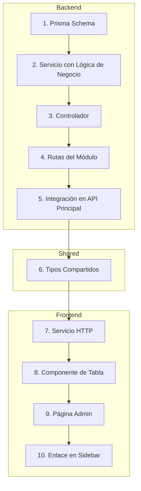

# Tareas Repetitivas Documentadas

Este archivo contiene guías paso a paso para tareas comunes en el proyecto, permitiendo acelerar el desarrollo y mantener la consistencia.

---

## Crear Módulo Admin de Solo Lectura

**Última ejecución:** 2025-11-01
**Ejemplo base:** Módulo de "Caja" (`/caja`) y "Almacén" (`/almacen`).

Esta tarea documenta el proceso para añadir una nueva sección en el panel de administración que únicamente muestra datos del backend sin permitir modificaciones (CRUD).

### Diagrama de Flujo

### Archivos a Crear/Modificar

Las variables `{moduleName}` y `{ModuleName}` deben ser reemplazadas por el nombre del nuevo módulo (ej: `reports`, `Reports`).

-   **Backend (`apps/backend`):**
    1.  `src/services/{moduleName}.service.ts`: Contiene la lógica de consulta a la base de datos.
    2.  `src/controllers/{moduleName}.controller.ts`: Orquesta la petición y respuesta.
    3.  `src/api/routes/{moduleName}.routes.ts`: Define el endpoint y aplica middlewares (ej: `authMiddleware`).
    4.  `src/api/index.ts`: Monta las nuevas rutas bajo un prefijo (ej: `/api/v1/{moduleName}`).

-   **Tipos Compartidos (`packages/types`):**
    5.  `src/index.ts`: Re-exporta los nuevos tipos.
    6.  `src/{moduleName}.ts`: Define los tipos de datos (ej: `Report`, `ReportWithRelations`).

-   **Frontend (`apps/frontend`):**
    7.  `services/{moduleName}Service.ts`: Define la función para llamar al nuevo endpoint.
    8.  `components/admin/{ModuleName}Table.tsx`: Componente React para visualizar los datos en una tabla.
    9.  `app/(admin)/{moduleName}/page.tsx`: Página principal del módulo que usa React Query (`useQuery`) para obtener los datos y renderizar la tabla.
    10. `components/layout/Sidebar.tsx`: Añade un nuevo enlace en el menú de navegación lateral.

### Pasos Detallados

1.  **Definir el Modelo (si es nuevo):**
    -   Añadir el modelo correspondiente en `apps/backend/prisma/schema.prisma` si aún no existe.
    -   Ejecutar `npm run db:generate --workspace=@mi-tienda/backend` para actualizar el cliente de Prisma.

2.  **Desarrollar el Backend (De adentro hacia afuera):**
    -   **Servicio:** Crea la clase `XxxService` con un método que use `prisma.xxx.findMany()` incluyendo las relaciones necesarias.
    -   **Controlador:** Crea la clase `XxxController` que inyecta el servicio y maneja la `Request` y `Response` de Express.
    -   **Rutas:** Crea `xxx.routes.ts`, instancia el controlador y define la ruta `GET` protegiéndola con `authMiddleware`.
    -   **API Principal:** Importa las nuevas rutas en `apps/backend/src/api/index.ts` y regístralas con `router.use('/xxx', xxxRoutes)`.

3.  **Crear Tipos Compartidos:**
    -   En `packages/types/src/{moduleName}.ts`, define los tipos o interfaces que representarán los datos, incluyendo las relaciones.
    -   Exporta todo desde `packages/types/src/index.ts`.

4.  **Desarrollar el Frontend:**
    -   **Servicio:** En `apps/frontend/services/`, crea `{moduleName}Service.ts` con una función `async` que use `api.get()` para consultar el nuevo endpoint.
    -   **Componente de Tabla:** Crea el componente `apps/frontend/components/admin/{ModuleName}Table.tsx` que recibe los datos como `props` y los renderiza.
    -   **Página:** Crea la página `apps/frontend/app/(admin)/{moduleName}/page.tsx`. Usa el hook `useQuery` de TanStack Query para llamar a la función del servicio y pasar los datos a tu componente de tabla, manejando los estados de carga y error.
    -   **Sidebar:** Edita `apps/frontend/components/layout/Sidebar.tsx` para añadir un nuevo `<Link>` al módulo, incluyendo un ícono de `lucide-react`.

5.  **Verificación:**
    -   Asegúrate de que los servidores de backend y frontend estén corriendo.
    -   Navega a la nueva ruta en el panel de admin y verifica que los datos se cargan y muestran correctamente.
    -   Revisa la consola del navegador y del backend por si hay errores.